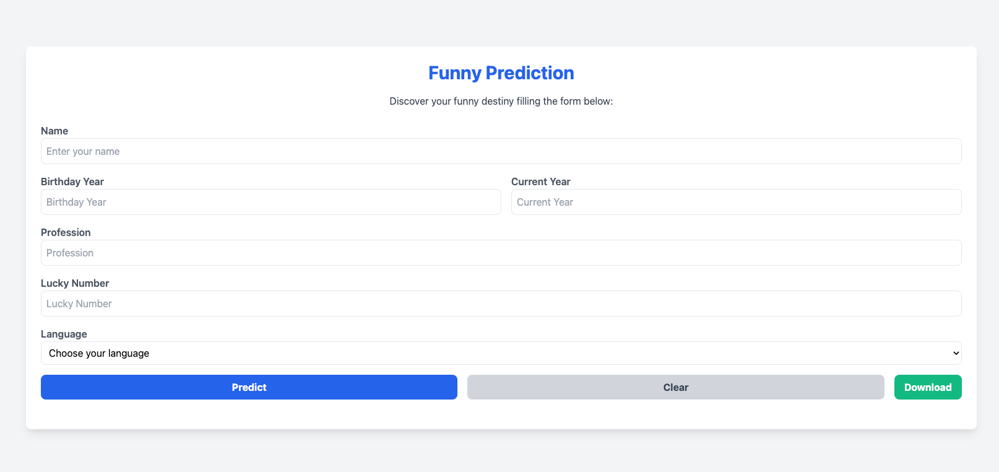

# Funny predictor

Work in progress

_deployed on https://retired-ferne-albz-1d13411a.koyeb.app/_

### TODO: 
- Add Ollama in self-hosted mode https://www.koyeb.com/deploy/ollama for koyeb

- Build locale 
`docker build --platform linux/amd64 -t <docker_user>/<app_name>:latest .`
`docker run --platform linux/amd64 -p 8000:8000 -p 11334:11334 --name <container-name> <docker_user>/<app_name>:latest`

After build go on exec 
`docker exec -it <images-id> /bin/bash`
and pull ollama model 
`ollama pull llama<model-version>`